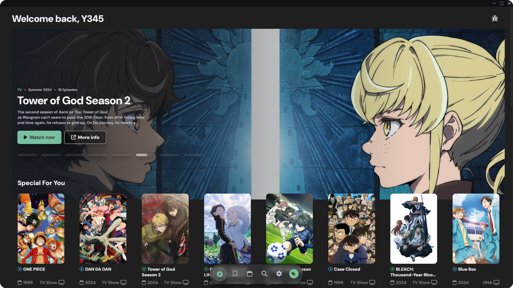

    
    <h1 align="center">Yanime</h1>

Your Ultimate Anime Desktop App To Watch without ads

     
    
    
    

    

 

# Languages

The languages where both the sub and dub don't work are implemented in the app, but they aren't selectable.

> Note: Universal doesn't always provide all the languages!

# Shortcuts

  
<h2>⌨ Shortcuts</h2>

  - Pages
    - F1: go to Discover page
    - F2: go to Library page
    - F3: go to Search page
  - Video player
    - Space: play/pause video
    - Left arrow: fast rewind (5s)
    - Right arrow: fast forward (5s)
    - Upper arrow: increase volume
    - Lower arrow: decrease volume
    - F11: fullscreen toggler
    - F: fullscreen toggler
    - M: mute/unmute video
    - P: play previous episode
    - N: play next episode

## 🐛 Known Issues

- If Log-In in installed apps doesn't work, make sure you have set a default browser.
- Some anime may not work due to different names compared to AniList. Feel free to open a new issue if you find any, so i can fixed.

## 🙌 Credits
- [This API](https://api.ani.zip/mappings?anilist_id=21): used to fetch episodes info and thumbnails
- [AniSkip API](https://api.aniskip.com/api-docs#/skip-times/SkipTimesControllerV2_getSkipTimes): used to fetch episode intros & outros.
- [Aniwatch API](https://github.com/ghoshRitesh12/aniwatch-api): used to get hianime episode sources if consumet fails to.
 

# Legal

## 📢 Disclaimer

- Yanime helps users find anime by simply scraping links from various websites.
- Yanime or its developers do not host the content found on Yanime. All images and anime information found in the app are retrieved from AniList public API.
- Additionally, all anime links found on Yanime are from various third party anime hosting websites.
- Yanime or its owner are not responsible for the misuse of any content inside or outside the app and shall not be responsible for the dissemination of any content within the app.
- By using this app, you agree that the app developer is not responsible for the content within the app. Nevertheless, they may or may not come from legitimate sources.
- For internet violations, please contact the source website. The developer is not legally responsible.

## 📜 License

Licensed under [MIT](https://opensource.org/license/mit).
